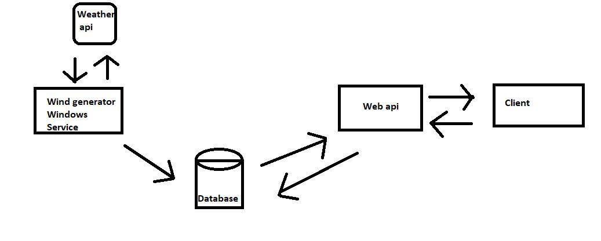

Requirements

VisualStudio 2019
Microsoft SQL Server Management Studio 18

The system contains: 
1.WebApi - web api communicates with the database also web api communicates with the client
2.Database 
3.Wind generator windows service - windows service communicates with the database. no communication between web api and windows service.

Setup

Open up solution in Visual Studio
Start Wind Generator Windows service
Start Wind Generator WEB API

Update database (PM> update-database) on Web api.
Build and Run

System architecture
